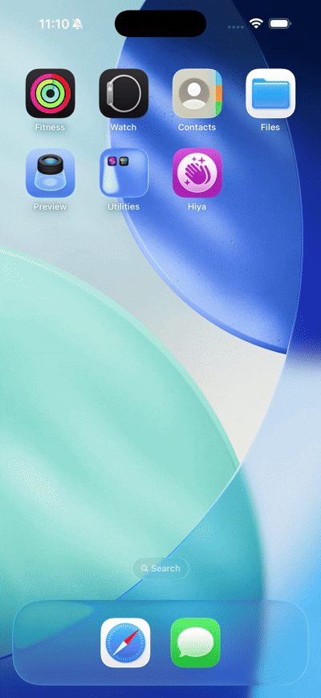
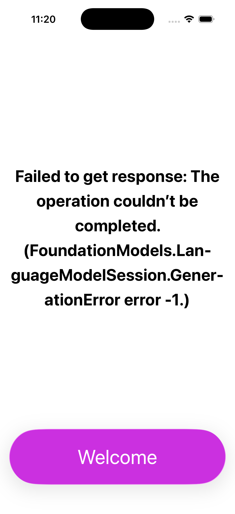
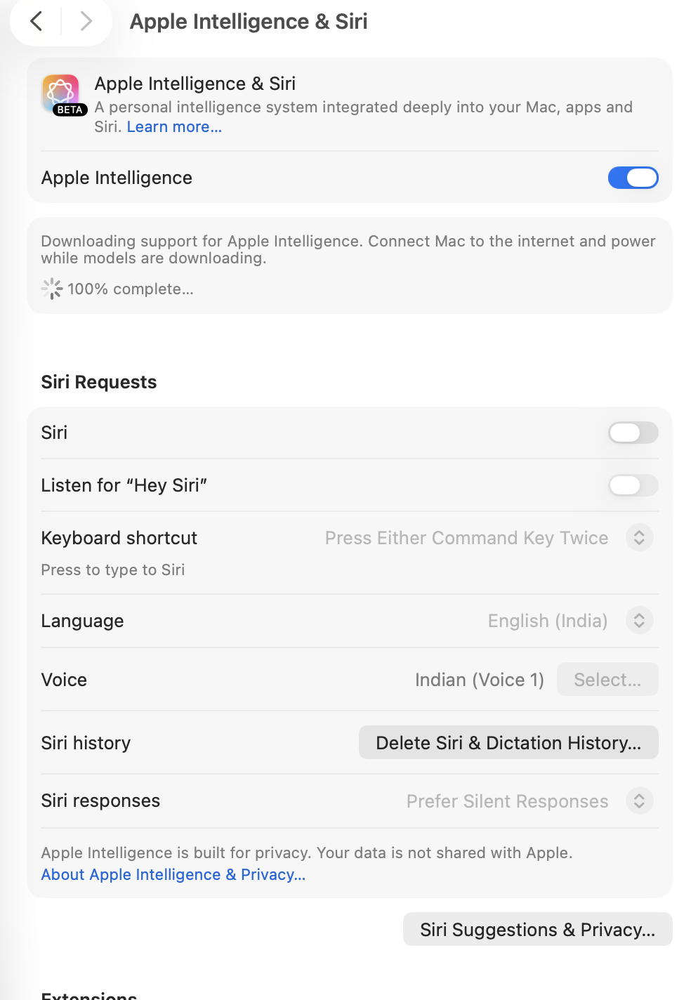

# HiyaAI App

This is a simple **SwiftUI** app utilising Apple's on device **Apple Intelligence** to respond to a predefined prompt. Out of Apple's in-built AI support frameworks - **Foundation model** and **CoreML**, I've used Foundation Models for this app.

APP PREVIEW :

  

## 🛠 Technical Stack & Architecture

• Xcode version : 26.4

• Language : Swift 6

• Framework: Foundations Model

 
## 🚀 Features

• Checks Apple Intelligence Model availability

• Button sends prompt, such as "say hi in a fun way," to the AI model

• Progress View shown until response is fetched

• Responsive user interface to show response from AI model

• At Start, no-content view is shown so that users might not feel something is broken

## 💡 What I Learned

• Designing using SwiftUI

• AI (Apple Intelligence) Model

• Foundations Model

## ✏️ Working

It's like API implementation where we send prompt to model, show progress view until data is fetched and then show data we recieve on UI.

• import FoundationModels

• make model object to check availability

    private var largeLanguageModel = SystemLanguageModel.default

• make session object to make requests

    private var session = LanguageModelSession()

• check availability and handle all cases

• Define prompt

• Send response to session

• Hnadle response

## ⚠️ Points To Note 

AVAILABILITY OF APPLE INTELLIGENCE

• iPhone: Device must support Apple Intelligence - AI is available from iPhone 15 Pro onward models only

• iPad/Mac: Any device with an M1 chip or later

• The device must have Apple Intelligence turned on in settings

• Make sure Apple Intelligence is downloaded and turned ON in mac settings

• Screenshots For Reference :

  
  &nbsp;&nbsp;&nbsp;&nbsp;&nbsp;&nbsp;&nbsp;&nbsp;&nbsp;&nbsp;&nbsp;&nbsp;&nbsp;&nbsp;
  

